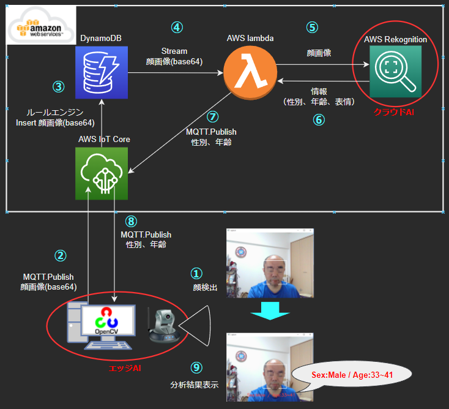

# エッジAIで顔検出、クラウドAIで顔分析

## 処理構造

全体構造を図示すると、以下のようになります。



## 処理のながれ

① PCのカメラで顔を撮影し、OpenCVのカスケード分類器で顔を検出。  
② 顔画像をAWSIoTCoreに送信(Publish)する。顔画像はBase64にエンコード。  
③ ルールエンジンを使用して画像をBase64のままDynamoDBに登録。  
④ テーブルのStreamでLambdaを起動。  
⑤ LambdaでBase64をデコードしてRekognition(画像分析AI)に渡す。  
⑥ JSONで認識結果が返却される。Lambdaでデータを取得。  
⑦⑧ MQTTでPCに分析した結果を戻す(Publish)。  
⑨ OpenCVで画面に分析結果文字を合成して、画面に表示。

<br>


## 実行結果
一瞬画面が止まって年齢が表示されるまでが、顔分析の時間です。   
ネットワーク環境に問題がなければ、おおむね<Font Color="Blue">**2秒弱で応答**</Font>が帰ってきます。  

  

↑ OpenCvの機能を使って「目」の部分にモザイク処理してます。  
（OpenCVには壁掛けの時計が「目」に見えるようですｗ）

<br>

## 環境構築(AWS環境)
### DynamoDB
- AWSコンソールでサービス「DynamoDB」を開く。
- 新規テーブルを作成する。
  - パーティションキーは「GetDateTime」(文字列)とする。

### IoT Core
- AWSコンソールでサービス「IoT Core」を開く。
- PCからMQTTを受信するため「モノ」を登録する。
  - 新しい「モノ」を作成する。
  - ルート公開鍵、モノの証明書、モノの秘密鍵はダウンロードすること(★1)
  - 「設定」画面を開き、「エンドポイント」を控えること(★2)

### Lambda
- AWSコンソールでサービス「Lambda」を開く。
- Python3.9をプラットフォームとして、新規関数を作成する。
- 添付のawas_lambdaソースを「lambda_function.py」として張り付ける。
- 「設定」の「アクセス権限」の登録ロールに以下のポリシーを追加すること。
  - AmazonDynamoDBFullAccess
  - AmazonRekognitionFullAccess
  - AWSIoTFullAccess
- 「設定」の「トリガ」に、上で作成したDynamoDBテーブルを設定する。

## 環境構築(PC-Python環境)
- 事前に、以下のライブラリをインポートすること。
  ``` bash
  # MQTTクライアント
  $ pip install paho-mqtt
  ``` 
- 添付のソースを任意のフォルダにダウンロードする。
- ソース「main.py」の上部にある、定数内容を以下のとおり修正する。

  ``` python
  # MQTT定義
  AWSIoT_ENDPOINT = "alij9rhkrwgll-ats.iot.ap-northeast-1.amazonaws.com"
  MQTT_PORT = 8883
  MQTT_TOPIC_PUB = "topicFaceDetect"
  MQTT_TOPIC_SUB = "topicFaceRekognition"
  MQTT_ROOTCA = "../AWSIoTCoreCert/AmazonRootCA1.pem"
  MQTT_CERT = "../AWSIoTCoreCert/d9b8932398a01d603702502e2293d52adb8a6b25a3ee4ee935eb511c704b662f-certificate.pem.crt"
  MQTT_PRIKEY = "../AWSIoTCoreCert/d9b8932398a01d603702502e2293d52adb8a6b25a3ee4ee935eb511c704b662f-private.pem.key"
  ```
  - 「AWSIoT_ENDPOINT」 ← ★2.エンドポイント
  - 「MQTT_ROOTCA」 ← ★1.ルート公開鍵
  - 「MQTT_CERT」← ★1.モノの証明書
  - 「MQTT_PRIKEY」 ← ★1.モノの秘密鍵


## 操作方法
- `main.py`を実行するとカメラが動作して、ウィンドウが表示される。
  ``` bash
  $ python3 main.py
  ``` 
- 顔検出された（白枠が出ている）状態でSpaceキーを押すと、顔分析開始。
- 顔分析の結果は、2~3秒後に画面下部に性別と年齢（の範囲）が出力される。
- Escキーを押すと、処理が終了する。
